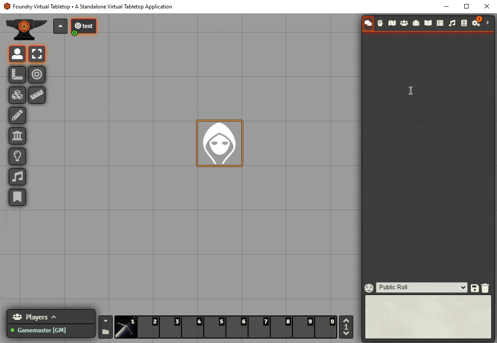
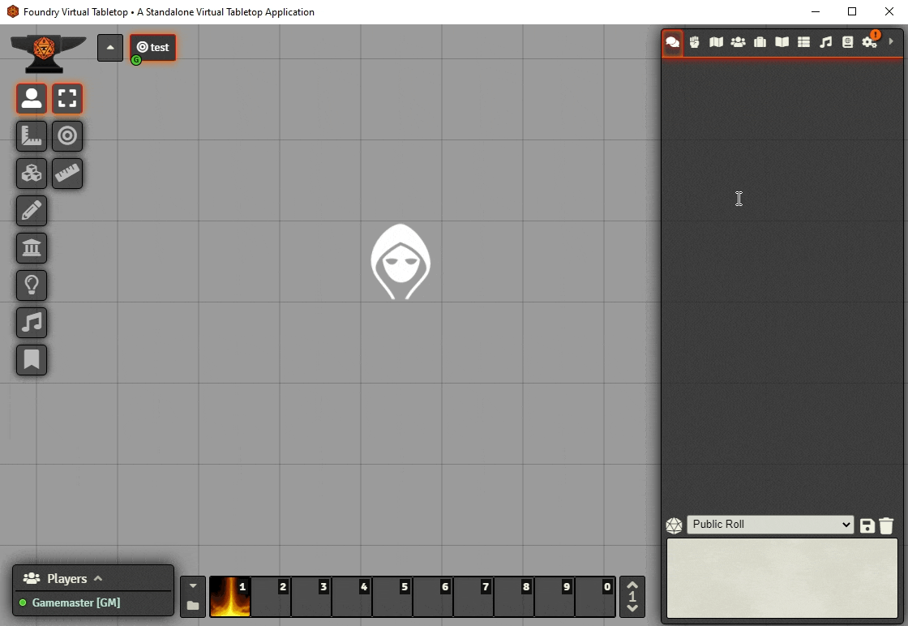

# DnD5e Quick Item Rolls

A module to simplify the interface for attack and damage rolls of weapons and cantrips.

## How it works

The standard chatlog interface for a weapon or cantrip involves clicking on the item to produce a card with several buttons. These can then be clicked to open new dialogs with additional options that then output rolls to the log. This module expedites this process so that a full attack and damage sequence can be accomplished in as little as two clicks.

The dialog opened by clicking on the item offers checkboxes to configure options like the use of versatile damage if the item supports it, as well as the typical advantage/normal/disadvantage buttons if the the item has an attack roll.

If the item clicked is a cantrip that calls for a saving throw rather than an attack roll, the damage is instantly sent to the chatlog. This card has a button that will roll the displayed saving throw for the token selected when the button is clicked.

This module can be quickly enabled/disabled by right-clicking on the `.chat-control-icon` (the d20 just above the chat message textarea) and toggling the **Quick Item Rolls** option.

### Automatic crit calculation

If the item clicked has an attack roll associated with it, the module will automatically determine whether the roll is a critical hit. By default, all characters will crit on a natural 20. The module will also check for the **weaponCriticalThreshold** flag located at `actor.data.flags.dnd5e.weaponCriticalThreshold` to see if that actor has a class feature (such as the Champion Fighter's **Improved Critical** feature) that lowers their critical hit threshold. And it will check the actual item's **Critical Hit Threshold** as declared in the item's details.

If the roll is determined to be a critical hit, the module will look either roll twice the damage dice, or it will roll the normal damage dice plus the maximum values for all critical damage dice if the **Perfect Crits** dependency module is enabled.

---

## Class Feature Support

The module also supports additional configurations for certain class features as listed below. These will offer additional checkboxes within the dialog opened by clicking on the item.

- Sneak Attack
  - The actor must have at least one Rogue class level, and must be attacking with an appropriate finesse or ranged weapon.
- Blessed Strikes
  - The actor must have at least eight Cleric class levels.
  - **Note**: The module does not support `Divine Strike` or `Potent Spellcasting` yet.

---

## Settings

This module can be enabled/disabled as usual on a user-by-user basis under `Configure Settings` &rarr; `Module Settings`. The same option is more quickly toggleable by right-clicking on the `.chat-control-icon` (the d20 just above the chat message textarea) and clicking the **Quick Item Rolls** option.

---

## Dependencies

- DnD5e Perfect Crits

  - manifest: https://raw.githubusercontent.com/BrettLargent/dnd5e-perfect-crits/main/module.json
  - url: https://github.com/BrettLargent/dnd5e-perfect-crits

- Foundry VTT Quick Module Context Menu Settings
  - manifest: https://raw.githubusercontent.com/BrettLargent/foundry-vtt-quick-module-context-menu-settings/main/module.json
  - url: https://github.com/BrettLargent/foundry-vtt-quick-module-context-menu-settings
